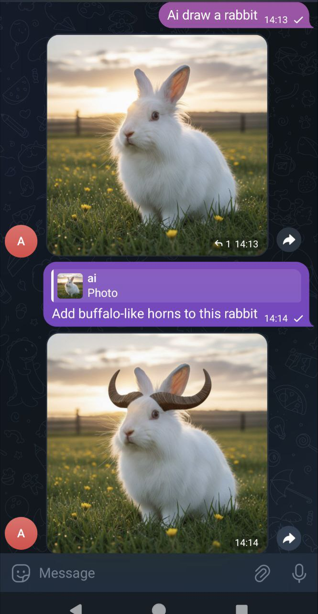

## Telegram bot for prompt-driven image editing

This telegram bot lets you create and edit image in prompt-based manner. It uses Google's AI model Gemini 2.5 Flash Image Preview. The model is decoupled properly, so to switch a provider, you just need to reimplement that single function from openrouter.py .

You will need your own OpenRouter key to access the AI model. As of September 2025 the price is about 3-4 US cents per image.

### Examples :

Here I ask bot to create a picture, and then I ask it to modify it:




## How to use

It is two ways to trigger the AI bot: 
- directly mentioning AI (or Ai,ai,aI) in a message
- replying to the bot
This allows very basic workflow: create image, modify, modify, modify...

In a chat where few people are, you can quote someone else's picture and let the bot work with it by mentioning "AI" in your message.

You can add your own picture when quoting.
You even can quote multi-picture post, and attach your own pictures to the message.

### Example :

Example with two photos:


## Installation

Create a bot using telegram's BotFather service. Collect the key and put it to .env file: 
`TELEGRAM_TOKEN=1234567:abcdef01234abcdef01234`

Register an account at OpenRouter, put $5 into it and proceed to Keys : [https://openrouter.ai/settings/keys](https://openrouter.ai/settings/keys) . Create a key and copy it to .env file: `OPENROUTER_API_KEY="sk-or-qwer-xxx-yyy-zzz"`

Run the bot. Add newly created bot to a telegram group. Write something to the group. Check bot's log files at `sess/<datetime>/msg-j01.txt` . Find message.chat.id . This would be an ID for your telegram group. It is a long negative number for a group, or a positive, for a user.

Add that number into the list of allowed groups at bot.py at
```python
    if chat_id not in [...]: return
```
and restart the bot.


# The text below is AI-generated

But still useful.


## Telegram AI Image Edit Bot

A Telegram bot that edits images using OpenRouter's Google Gemini image editing model. The bot listens for messages in configured chats, collects referenced images (including replied images and albums), and returns an edited image generated from your prompt.

Key entry points:
- [bot.py](bot.py) — bot runtime, handlers, job queue, and message orchestration via [def main()](bot.py:177), [def handle_message()](bot.py:37), and [def process_prompt()](bot.py:150)
- [openrouter.py](openrouter.py) — OpenRouter API integration via [def openrouter_request_gemini_imageedit()](openrouter.py:25)
- [db.py](db.py) — SQLite storage for messages and photos via [class Database](db.py:4)
- [session.py](session.py) — Session helpers for logging payloads, inputs, and outputs via timestamped folders (e.g., sess/, sess2/, sess_payload)

License: MIT. See [LICENSE](LICENSE).

---

## Features

- Triggers image edits when the message contains the token "ai" (case-insensitive) or when replying to the bot's previous output.
- Works with:
  - Single images
  - Replying to an image
  - Albums (media groups) — aggregates all images in a media group
- Persists:
  - Incoming messages (with minimal metadata and JSON snapshot)
  - Downloaded photos (de-duplicated by Telegram photo_id)
- Retries Telegram API send on timeouts
- Logs OpenRouter requests and responses, and stores generated outputs to disk

---

## Architecture Overview

- Bot Orchestration: [def main()](bot.py:177) creates the Application and registers handlers for:
  - [/start](bot.py:180) via [def start()](bot.py:27)
  - Messages (text, caption) via [def handle_message()](bot.py:37)
  - Photos via [def handle_message()](bot.py:37)
- Async Job Flow:
  1. [def handle_message()](bot.py:37) captures context, persists incoming data, collects mentioned photos
  2. Schedules [def delay_message_processing()](bot.py:131) via job queue to aggregate media and call
  3. [def process_prompt()](bot.py:150) which calls [def openrouter_request_gemini_imageedit()](openrouter.py:25) and replies with the generated image(s)
- OpenRouter Integration: [def openrouter_request_gemini_imageedit()](openrouter.py:25) posts a chat completion with mixed content (text prompt and image data URLs) and returns the generated image bytes
- Storage:
  - SQLite file: telegram_bot.db (created automatically)
  - Tables: migrations, messages, photos
  - File logs: session folders (sess/, sess2/, sess_payload/…), incoming/ for saved result images

---

## Requirements

- Python 3.10+ recommended
- A Telegram Bot token
- An OpenRouter API key with access to Google Gemini image models

Python dependencies (see [requirements.txt](requirements.txt)):
- python-dotenv
- python-telegram-bot[job-queue]==22.3
- requests
- data_url

Install with:
```bash
python -m venv .venv
. .venv/bin/activate
pip install -r requirements.txt
```

---

## Environment Variables

Create a .env file in the project root:
```dotenv
OPENROUTER_API_KEY=your_openrouter_api_key_here
TELEGRAM_TOKEN=your_telegram_bot_token_here
```

The bot loads these via [python.import()](bot.py:2) and `load_dotenv()`.

---

## Running the Bot

```bash
. .venv/bin/activate
python bot.py
```

On startup you should see:
```
started...
```

---

## How To Use (in Telegram)

1. Invite your bot to a group or DM the bot directly.
2. Post or reply to an image and include the token "ai" (case-insensitive) anywhere in your message/caption.
   - Example: "ai make it look like a watercolor painting"
3. The bot will:
   - Persist your message and download referenced image(s)
   - Send a request to OpenRouter Gemini image model
   - Reply with the generated image

You can also reply to the bot’s previous image with another instruction; [def handle_message()](bot.py:37) routes such replies to the processor even without the "ai" token.

Ping check:
- Send "ping" (exact text) to get "pong" back (and the set of mentioned photos), see [python.if](bot.py:110).

---

## Configuration Notes

- Allowed Chat IDs: For safety, the bot responds only in specific hardcoded chats. Edit the whitelist in [python.if](bot.py:49):
  ```python
  if chat_id not in [-1002199005809, -1002211084712, -498556509, -4590114841, -1001858292142]: return
  ```
  Replace with your allowed chat IDs (negative numbers for groups/supergroups). To test in DM, add your user or chat ID accordingly.

- Model:
  - Default model is "google/gemini-2.5-flash-image-preview" in [def openrouter_request_gemini_imageedit()](openrouter.py:41). You can change it to another image-capable model supported by OpenRouter.

- Prompt Formatting:
  - The code prepends "output an image." to your prompt in [python.assign()](openrouter.py:34) to steer generation.

---

## Data Persistence

- SQLite file: telegram_bot.db (auto-created). Schema is managed by idempotent migrations in [class Database](db.py:4) / [def setup_migrations()](db.py:22)
  - Table messages: user_id, chat_id, message_id, media_group_id, message_text, photo_id, message_json, timestamp
  - Table photos: photo_id (PK), photo_blob, media_group_id
- Binary assets:
  - Generated images from OpenRouter are saved under incoming/ with unix timestamp and proper extension in [def data_url_image_to_bytes()](openrouter.py:88)
  - Session artifacts (payloads, inputs, outputs) saved in timestamped folders via [class Session](session.py:8)

Database dump helper:
```bash
./database-dump.sh
```
This should export the database to a file (inspect the script for exact behavior).

---

## Files and Responsibilities

- [bot.py](bot.py)
  - Telegram App setup: [def main()](bot.py:177)
  - Handlers: [def start()](bot.py:27), [def handle_message()](bot.py:37)
  - Processing: [def delay_message_processing()](bot.py:131), [def process_prompt()](bot.py:150)
- [openrouter.py](openrouter.py)
  - API integration: [def openrouter_request_gemini_imageedit()](openrouter.py:25)
  - Data URL parsing and file saving: [def data_url_image_to_bytes()](openrouter.py:88)
- [db.py](db.py)
  - Database lifecycle and queries: [class Database](db.py:4)
- [session.py](session.py)
  - Per-run session logging and file IO helpers: [class Session](session.py:8)
- [deploy.sh](deploy.sh)
  - Optional deployment helper script (customize for your environment)
- [database-dump.sh](database-dump.sh)
  - Optional backup/export helper

---

## Deployment

- Ensure the environment variables are available (prefer systemd or your orchestrator’s secret store instead of a .env in production).
- Consider running via:
  - systemd service (restart on failure)
  - Docker (mount persistent volume for DB and session logs)
- OpenRouter networking: outbound HTTPS to https://openrouter.ai
- Storage:
  - Persist telegram_bot.db
  - Persist incoming/ and sess*/ if you want to keep generated and diagnostic artifacts

---

## Security and Privacy

- Chat whitelist in [python.if](bot.py:49) prevents unwanted use. Keep it updated.
- Do not log secrets. The bot writes:
  - request payloads without API keys
  - image files and responses for debugging
- If handling sensitive images, ensure disk encryption or clean-up policies for incoming/ and sess*/ directories.

---

## Troubleshooting

- Bot doesn’t respond
  - Confirm TELEGRAM_TOKEN and OPENROUTER_API_KEY in .env
  - Verify the chat is whitelisted in [python.if](bot.py:49)
  - Check console for "started..." and runtime errors
- Timeout when sending media
  - The bot retries up to 5 times in [python.try](bot.py:161). If it still fails, inspect network conditions.
- No image generated
  - Ensure the prompt contains "ai" or you reply to the bot’s image message
  - Verify the OpenRouter model is image-capable and your key has access
  - Check sess_payload/ reply payloads and incoming/ for saved images
- DB errors
  - Delete telegram_bot.db for a clean start (will recreate schema). Backup first with [database-dump.sh](database-dump.sh)

---

## Extending

- Change model or provider constraints in [def openrouter_request_gemini_imageedit()](openrouter.py:41).
- Add explicit commands (e.g., /help, /version) by registering new CommandHandlers in [def main()](bot.py:180).
- Replace whitelist with an environment variable or admin-only command to update allowed chat IDs at runtime.

---

## License

MIT — see [LICENSE](LICENSE).